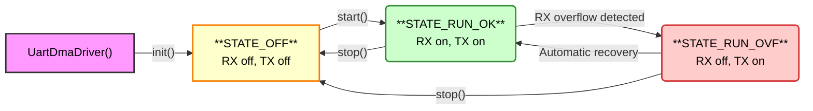

# FreeRTOS Real-Time UART Driver for RP2040 & RP2350

## Table of Contents
- [Intro](#intro)
- [Problem Solved](#problem-solved)
- [API Reference](#api-reference)
- [Use Examples](#use-examples)
- [Advanced Usage](#advanced-usage)
- [TX Architecture Details](#tx-architecture-details)
- [Driver Configuration](#driver-configuration)
- [Multi-Instance Support](#multi-instance-support)
- [Test Suite](#test-suite)
- [Performance Characteristics](#performance-characteristics)
- [Installation](#installation)

## Intro

This project is a real-time C++ UART driver for the RPi RP2040 & RP2350 microcontrollers, designed for use with Pico-SDK + FreeRTOS. It leverages the hardware DMA controller to provide high performance & responsiveness, with a simple & event-based API for handling serial data asynchronously in both directions.

The driver's design avoids useless CPU load & RTOS context switches during data transmission, eliminating the need for dedicated threads or application-level polling. User tasks can pend on an event queue and will only be scheduled for execution when data is available to read or when a specific UART event occurs. It is suitable for applications requiring reactive message- or stream-based serial communication, such as TCP over UART, Modbus RTU, PPP or other protocols.

### Usage Example

Here is a minimal example of a FreeRTOS task that initializes the driver and processes incoming data events.

```cpp
#include "UartDmaDriver.hpp"
#include "FreeRTOS.h"
#include "task.h"

// UART configuration
constexpr uart_inst_t* UART_INSTANCE = uart0;
constexpr uint8_t UART_TX_PIN = 0;
constexpr uint8_t UART_RX_PIN = 1;
constexpr uint32_t BAUD_RATE = 115200;

// Create a driver instance
UartDmaDriver uart_driver(UART_INSTANCE, UART_TX_PIN, UART_RX_PIN, BAUD_RATE);

void uart_processing_task(void* param) {
    // Initialize the driver
    if (uart_driver.init() != UartDmaDriver::SUCCESS) {
        // Handle initialization failure
        vTaskDelete(NULL);
    }
    
    // Start UART transmission
    uart_driver.start();
    
    // UART event & data buffers
    UartDmaDriver::Event event; // Stores 1 received event
    uint8_t buffer[256];        // Stores data - matches max event data size
    
    while (true) {
        // Sleeps indefinitely until next event received from the driver
        // Totally yields to the scheduler, no busy wait
        if (!uart_driver.popEvent(&event, portMAX_DELAY)) {
            continue; // Timeout or error, retry
        }
        
        if (event.type == UartDmaDriver::EVT_DATA) {
            // Data is available, read it from the internal buffer
            size_t to_read = std::min(event.size, sizeof(buffer));
            size_t bytes_read = uart_driver.read(buffer, to_read);
            if (bytes_read > 0) {
                // Process the received data...
                printf("Received %zu bytes.\n", bytes_read);
            }
        }
        else if (event.type == UartDmaDriver::EVT_OVERFLOW) {
            // The internal ring buffer overflowed.
            // The driver has paused reception until space is freed by read().
            printf("Error: UART RX overflow detected.\n");
        }
    }
}
```

### Problem Solved

Creating a real-time UART driver for RP2040/RP2350 requires addressing fundamental hardware limitations:

- **FIFO:** The hardware UART FIFO (32 bytes) is insufficient for real-time applications. High-speed data streams can overflow the FIFO between task switches, causing data loss.

- **IRQ:** UART IRQs create significant CPU overhead at high baud rates. Each byte generates an interrupt, creating jitter and consuming CPU cycles that impact real-time performance. At 921600 bps, this results in ~92,000 interrupts per second.

- **Task-Based Buffer Management:** Using a dedicated FreeRTOS task to manage software buffers would be counterproductive. The overhead of context switching, stack allocation, and task scheduling would likely exceed the cost of direct polling, especially at high baud rates.

- **DMA:** Direct Memory Access is the only viable solution for zero-CPU data transfer. However, the RP2040/RP2350 DMA controller has a fundamental limitation: it only generates IRQs upon transfer completion, not during ongoing transfers like on other platforms (e.g. STM32 half-transfer interrupts). For continuous data streams, this means no notification until the entire transfer count is reached: it is then too late to react and drain the buffer while new data continue to arrive.

#### Solution Architecture

This driver circumvents the DMA limitation by combining:

1. **Circular DMA Buffer:** DMA runs indefinitely, writing incoming bytes to a ring buffer without CPU intervention.

2. **Hardware Timer Watchdog:** A `repeating_timer` periodically samples the DMA write pointer to detect new data without interrupting data flow. When activity or silence periods are detected, it pushes `Event` messages to a FreeRTOS queue, allowing application tasks to pend with zero CPU usage until being notified that a new chunk of data is ready to fetch in the RX buffer.

3. **Automatic Flow Control:** The watchdog monitors buffer usage and automatically halts DMA production when the ring buffer approaches capacity. If the application doesn't consume data fast enough, reception is temporarily stopped to avoid valid, already-buffered data being corrupted. Reception automatically resumes when the application drains sufficient buffer space.

The `Event` structure contains metadata about data availability but not the data itself:

```cpp
struct Event {
    EventType type;        // EVT_DATA or EVT_OVERFLOW
    size_t size;           // Size of last received chunk (guaranteed available to read)
    bool silenceFlag;      // True if triggered by silence detection
    uint64_t timestampUs;  // Hardware timestamp
};
```

Events notify about data availability, but applications must call `read()` to actually retrieve the data from the internal ring buffer. No copy is performed by the watchdog routine, it is a lightweight ISR that only pushes small amount of data in the queue when necessary.

This design achieves purely interrupt-driven operation with background data transfers handled entirely by the DMA controller. The result is real-time performance with minimal CPU overhead (<2%), automatic overflow protection, and built-in message framing for protocols that use silence as frame delimiters (e.g. Modbus RTU).

#### Rationale

- **No StreamBuffer/Queue for data storage:** The driver keeps minimal RAM footprint by not buffering data beyond the DMA ring buffer. The user application decides whether to store, process immediately, or forward data, maintaining maximum flexibility and avoiding unnecessary memory allocation.

- **No callback-based API:** Instead of callbacks, the driver uses FreeRTOS event queues to avoid complexity and constraints:
  - **No ISR context restrictions:** User code runs in normal task context, not interrupt context
  - **No dedicated stack requirements:** No need for special stack allocation for callback execution  
  - **Simple integration:** Clean integration with FreeRTOS applications using standard queue mechanisms
  - **User control:** The application decides how to handle data flow and timing

## API reference

### Result Type

Most public API methods return a `Result` enum for error handling:

```cpp
enum Result {
    SUCCESS = 0,           // Successful operation
    ERR_NOT_INITIALIZED,   // Driver not initialized via init()
    ERR_STATE,             // Invalid driver state for operation
    ERR_CONFIG,            // Invalid configuration parameters
    ERR_UART,              // UART hardware error
    ERR_BUSY,              // Driver busy with another operation
    ERR_TX_OVERFLOW,       // TX data exceeds buffer size
    ERR_TX_BUSY,           // TX timeout waiting for completion
};

// Convert result to human-readable string
const char* UartDmaDriver::toString(Result result);
```

### Lifecycle

The driver's lifecycle is managed through the following methods:

```cpp
// Constructor: create instance with UART settings
UartDmaDriver::UartDmaDriver(uart_inst_t* uart, uint8_t txPin, uint8_t rxPin, 
                   uint32_t baudRate, uint dataBits, uint stopBits, uart_parity_t parity)
```

*   **`Result init()`** - Initializes hardware resources (DMA channels, UART peripheral, GPIO pins, event queue). Must be called once before any other operation.

*   **`Result start()`** - Starts RX/TX operations by configuring DMA channels and starting the watchdog timer.

*   **`Result stop()`** - Stops all operations and resets to safe state. Destructor automatically calls this.

**Common Error Codes:**
- `ERR_NOT_INITIALIZED`: `init()` not called before `start()` or other operations
- `ERR_STATE`: Invalid state transition (e.g., calling `start()` when already running)
- `ERR_CONFIG`: Invalid parameters / failed initialization
- `ERR_UART`: Hardware failure (DMA channel unavailable, GPIO configuration failed)
- `ERR_BUSY`: Driver busy with another operation (`start()`, `stop()`, ...)

### State

The driver operates in one of three states, which can be queried using `State getState()`:

```cpp
enum State {
    STATE_OFF,      // Driver stopped, no data transmission
    STATE_RUN_OK,   // Normal operation, actively sending/receiving data via DMA
    STATE_RUN_OVF   // Overflow detected, RX DMA paused until buffer drained
};
```

**State transitions:**
- **`STATE_OFF`**: Default state. Call `start()` to transition to `STATE_RUN_OK`
- **`STATE_RUN_OK`**: Normal operating state with active DMA reception
- **`STATE_RUN_OVF`**: Emergency state when ring buffer is full. RX is paused to prevent data loss. Application must call `read()` to consume data -> driver automatically attempts recovery to `STATE_RUN_OK` when sufficient buffer space becomes available. An `EVT_OVERFLOW` event is pushed when entering this state.



### RX - Events

Data reception is managed through an event-driven model. The application task waits for events and reacts accordingly.

#### Event Structure

Each event contains metadata about data availability:

```cpp
struct Event {
    EventType type;       // Type of event (EVT_DATA or EVT_OVERFLOW)
    size_t size;          // Event data size (max 256 with default configuration)
    bool silenceFlag;     // True if EVT_DATA triggered by silence detection
    uint64_t timestampUs; // Hardware timestamp when event was generated
};
```

**Event types:**
```cpp
enum EventType {
    EVT_DATA,      // Data available to read (size > 0)
    EVT_OVERFLOW   // Ring buffer overflow detected, DMA reception paused
};
```

#### Event Methods

*   **`bool popEvent(Event* outEvent, TickType_t waitTicks)`**
    This is the primary method for receiving notifications. It attempts to receive an event from the internal queue.
    *   `outEvent`: A pointer to an `Event` struct where the event details will be stored.
    *   `waitTicks`: A standard FreeRTOS tick count to wait for an event. Use `portMAX_DELAY` to yield indefinitely.
    *   **Returns:** `true` if an event was received, `false` on timeout.

*   **`size_t read(uint8_t* dst, size_t maxLen)`**
    This method is used to copy the data from the driver's internal ring buffer into an application-provided buffer, for example after receiving a `EVT_DATA` event.
    *   **Returns:** The number of bytes actually read.
    *   **Important:** Always call `read()` after receiving `EVT_DATA` events to consume data and prevent buffer overflow. Using a fixed buffer of ≤256 bytes (default max event data size) to process each event guarantees no data loss if you stay in sync with the event queue.
    *   **Flexible:** `read()` will copy any data available in the buffer that fits into a `maxLen` array. It is possible that when it's called, it finds more data than already advertised in the event queue. You can call `read()` multiple times if you want to read incoming data as fast as possible.

*   **`size_t available() const`**
    Returns the number of bytes currently available to read in the ring buffer without blocking.
    *   **Returns:** Number of bytes ready to be consumed via `read()`.
    *   Useful for polling-style applications or to check buffer status before calling `read()`.
    *   **Non-blocking:** Always returns immediately.

*   **`uint32_t getDropped() const`**
    Returns the count of events that were dropped due to event queue overflow.
    *   **Returns:** Total number of events lost since driver initialization.
    *   Indicates if the application is not consuming events fast enough.
    *   **Reset:** Counter is reset when calling `start()` or driver reinitialization.

### Runtime Configuration

Normally, the driver is configured using compile flags (see `Driver Configuration` section) but out of convenience, the API provides methods to change Watchdog timing & baud rate at runtime, enforcing the same safety rules than with static asserts. Those methods can only be called if the driver is in `STATE_OFF` state.

*   **`Result setWatchdogTiming(uint32_t tickUs, uint8_t silenceTicks)`**
    Configures the watchdog timer parameters at runtime.
    *   `tickUs`: Watchdog timer tick period in microseconds (100-10000)
    *   `silenceTicks`: Number of ticks to consider as silence (2-20)
    *   **Returns:** `SUCCESS` if configuration was set, error otherwise

*   **`Result setBaudrate(uint32_t baudRate)`**
    Changes the UART baud rate at runtime (hot change when safe).
    *   `baudRate`: New baud rate (must be a standard rate)
    *   **Returns:** `SUCCESS` if baud rate was changed, error otherwise
    *   **Thread-Safe:** Protected by mutex, waits for TX completion

*   **`static bool isStandardBaudrate(uint32_t baudRate)`**
    Validates if a baud rate is in the list of supported standard rates.
    *   **Returns:** `true` if baud rate is standard (9600, 19200, 38400, 57600, 115200, 230400, 460800, 921600)
    *   **Usage:** Helper method for validation before calling `setBaudrate()`

### TX - Asynchronous Transmission

*   **`Result send(const uint8_t* data, size_t len, TickType_t waitTicks = portMAX_DELAY)`**
    Transmits a block of data over UART using DMA. This method is thread-safe and asynchronous.
    *   Uses a dedicated TX DMA channel for zero-CPU transmission.
    *   The data is copied to an internal DMA buffer (max 256 bytes by default) protected by a binary semaphore.
    *   The calling sender will yield until the previous transmission completes (becomes available again) or timeout occurs.
    *   Returns immediately after starting the DMA transfer: TX completion is handled by IRQ, releasing the semaphore for the next transmission.
    *   `waitTicks`: FreeRTOS tick count to wait for TX to become available. Use `portMAX_DELAY` to yield indefinitely.

*   **`bool isTxBusy()`**
    Non-blocking method to check if a transmission is currently in progress.
    *   Returns `true` if TX DMA is actively transmitting data.
    *   Returns `false` if TX is idle and ready for new data.

## Use Examples

### Basic Echo Task

This example reads any incoming data and sends it back, demonstrating both RX and TX paths.

```cpp
void echo_task(void* param) {
    uart_driver.init();
    uart_driver.start();
    
    UartDmaDriver::Event event;
    uint8_t buffer[512]; // Exceeds default max event data size
    
    while (true) {
        // Fetch data event
        if (!uart_driver.popEvent(&event, portMAX_DELAY)) continue;
        if (event.type != UartDmaDriver::EVT_DATA) continue;
        
        // Read RX buffer
        size_t bytes_read = uart_driver.read(buffer, sizeof(buffer));
        if (bytes_read == 0) continue;
        
        // Send TX echo
        uart_driver.send(buffer, bytes_read);
    }
}
```

## Advanced Usage

### Multi-Source Event Handling with xQueueSet

Many embedded applications need to react to multiple event sources while maintaining execution order and minimal latency. For example, a protocol translator (e.g. Modbus ASCII<>RTU) that must:
- Process incoming requests from user (ASCII UART) and fan them out to field devices (RTU UART)
- Process incoming responses from RTU UART and forward them to ASCII UART
- Do other things in parallel: handle TCP connections, watchdog monitoring, diagnostics...

FreeRTOS `xQueueSet` **allows writing applications like a superloop** but efficiently:

```cpp
// FreeRTOS Queue Set types
typedef void* QueueSetHandle_t;
typedef void* QueueSetMemberHandle_t;

// Create queue set for multiple event sources  
QueueSetHandle_t xQueueCreateSet(UBaseType_t uxEventQueueLength);

// Add/remove queues from set
BaseType_t xQueueAddToSet(QueueSetMemberHandle_t xQueueOrSemaphore, QueueSetHandle_t xQueueSet);
BaseType_t xQueueRemoveFromSet(QueueSetMemberHandle_t xQueueOrSemaphore, QueueSetHandle_t xQueueSet);

// Block until any queue in set has data
QueueSetMemberHandle_t xQueueSelectFromSet(QueueSetHandle_t xQueueSet, TickType_t xTicksToWait);

// Access driver's internal queue handle
QueueHandle_t getEventQueueHandle() const;
```

**Example - Protocol Gateway:**
```cpp
void gateway_task(void* param) {
    QueueSetHandle_t queueSet = xQueueCreateSet(20);
    
    // Add multiple event sources
    xQueueAddToSet(uart_driver.getEventQueueHandle(), queueSet);
    xQueueAddToSet(ascii_to_rtu_queue, queueSet);
    xQueueAddToSet(rtu_to_ascii_queue, queueSet);
    
    while (true) {
        // Process next available event - superloop style but efficient
        QueueSetMemberHandle_t activeQueue = xQueueSelectFromSet(queueSet, portMAX_DELAY);
        
        if (activeQueue == uart_driver.getEventQueueHandle()) {
            // Handle UART data
            if (xQueueReceive(uart_driver.getEventQueueHandle(), &event, 0) == pdPASS) {
                if (event.type == UartDmaDriver::EVT_DATA && event.silenceFlag) {
                    // Process complete frame...
                    process_uart_frame();
                }
            }
        } else if (activeQueue == ascii_to_rtu_queue) {
            // Handle command transmission
            if (xQueueReceive(ascii_to_rtu_queue, &bridge_msg, 0) == pdPASS) {
                uart_driver.send(bridge_msg.data, bridge_msg.length);
            }
        }
        // Handle other queues...
    }
}
```

**Key advantages:**
- **Performant superloop** - processes events in arrival order without busy-waiting
- **Minimal latency** - skips idle tasks and jumps to next available event
- **Efficient CPU usage** - no polling, non-blocking, yields until any event arrives
- **Scalable** to many event sources

**Complete working example** implementation available in `examples/advanced_uart.cpp`.

**Important:** When using `xQueueSet`, do not call `popEvent()` concurrently as it would interfere with the queue set mechanism. Instead, use `xQueueReceive` with 0 timeout in your processing/worker functions. See the [official FreeRTOS docs](https://www.freertos.org/Documentation/02-Kernel/04-API-references/07-Queue-sets/01-xQueueCreateSet) for a more complete overview.

## TX Architecture Details

The TX subsystem uses a dedicated DMA channel with the following characteristics:

*   **Zero-CPU Transmission:** Data is copied once into an internal DMA buffer, then transmitted without CPU intervention.
*   **Asynchronous Operation:** The `send()` method returns immediately after starting the DMA transfer.
*   **Semaphore-Based Flow Control:** A binary semaphore manages access to the TX channel, preventing data corruption from concurrent sends.
*   **IRQ-Based Completion:** TX completion is detected via DMA IRQ, automatically releasing the semaphore for the next transmission.
*   **Thread Safety:** Multiple tasks can safely call `send()` concurrently - they will be serialized by the semaphore.

### TX Error Handling

**TX-specific error codes (enum Result):**
- `SUCCESS`: Data queued for transmission
- `ERR_NOT_INITIALIZED`: Driver not initialized via `init()`
- `ERR_BUSY`: Driver busy with another operation
- `ERR_STATE`: Driver is stopped (`STATE_OFF`)
- `ERR_TX_BUSY`: TX timeout - previous transmission didn't complete within `waitTicks`
- `ERR_TX_OVERFLOW`: Data size exceeds `DMA_TX_BUFFER_SIZE` (256 bytes)

## Driver Configuration

The driver behavior can be customized using compile-time definitions in `UartDmaDriver.hpp`. All parameters are validated at compile-time by static assertions in the `UartDmaDriver_Assert` namespace to prevent misconfiguration.

### RX Configuration

*   **`UART_RX_MAX_BAUDRATE`**
    *   This constant serves a dual purpose for ensuring driver safety:
        1.  Compile-Time Contract: It is the reference value used by `static_assert` to validate that other timing parameters (like `UART_WD_TICK_US`) are safe and can prevent overflows *at this maximum speed*.
        2.  Runtime Enforcement: The `init()` method will **return an error** if the `baudRate` provided at runtime exceeds this value. This guarantees the driver never operates outside the performance envelope for which its timing was validated at compile time.
    *   Usage: If your application will only ever use lower baud rates (e.g., max 115200), lowering this constant will relax the compile-time checks, offering more flexibility for other timing parameters.
    *   Default: `921600`

*   **`UART_DMA_RING_BITS`**
    *   Defines the DMA ring buffer size as a power-of-2 exponent (Buffer Size = 2^N bytes).
    *   Range: `9` (512 bytes) to `15` (32KB).
    *   Default: `11` (2048 bytes).

*   **`UART_RX_MAX_EVT_DATA_SIZE`**
    *   The maximum size (in bytes) of a single `EVT_DATA` event's payload. This defines the largest chunk of data the driver will notify in one event, making the application's buffer management predictable.
    *   Default: `256` bytes.

*   **`UART_EVENT_Q_SIZE`**
    *   The depth (number of events) of the internal FreeRTOS event queue.
    *   Default: `20` events.

### Watchdog Timing

*   **`UART_WD_TICK_US`**
    *   Watchdog timer interval in microseconds for checking new data.
    *   Default: `450` (~2200 Hz)

*   **`UART_WD_SILENCE_TICKS`**
    *   The number of consecutive watchdog ticks after which the watchdog will advertise any unpublished data. This mechanism is critical for reactivity and very important for protocols framed by idle periods.
    *   Total silence duration = `UART_WD_TICK_US × UART_WD_SILENCE_TICKS`.
    *   Default: `4` (yielding a 1.8 ms silence detection).

### TX Configuration

*   **`UART_TX_BUFFER_SIZE`**
    *   Size of the internal TX DMA buffer. Limits maximum size of a single `send()` operation.
    *   Default: `256`

### Compile-Time & Runtime Safety

**1. Compile-Time Guarantees**

The driver's reliability is ensured by a **compile-time safety contract**, enforced by four key `static_assert` checks:

- **DMA Buffer Integrity**: ensures the DMA ring buffer is a valid power-of-two size, a hardware requirement for the RP2040/RP2350's circular mode.

- **Overflow Detection Guarantee**: guarantees the DMA's safety margin ("overflow watermark") is large enough to hold data from at least **three missed watchdog ticks** at maximum baud rate, ensuring the driver can always stop reception before the RX buffer wraps around.

- **Event Queue Back-Pressure Prevention**: verifies the event queue is large enough to buffer notifications for the **entire DMA ring buffer** plus some free space for an overflow event, preventing the queue itself from becoming a bottleneck & ensuring overflow events won't be silently dropped.

- **Secure Chunking**: ensures the maximum chunk size is large enough to accommodate data from at least **three watchdog ticks** at maximum baud rate, ensuring event generation will always catch up with the data flow under heavy load.

These compile-time checks ensure that any chosen configuration forms a logically coherent and safe system before execution.

**2. Runtime Guarantees**

The `init()` method provides the final layer of safety by **enforcing the contract** established at compile-time. It will fail and return an error if the requested `baudRate` exceeds the `UART_RX_MAX_BAUDRATE` value that was used for all safety calculations.

**3. Standard Baud Rate Enforcement**

The driver enforces the use of **standard baud rates only** to ensure reliable timing calculations and prevent timing-related issues using the chip's standard UART baud range:

*   **Supported rates:** 9600, 19200, 38400, 57600, 115200, 230400, 460800, 921600 baud
*   **Validation:** Both `init()` and `setBaudrate()` will reject non-standard rates with `ERR_CONFIG`

This three-stage process (compile-time checks + runtime validation + standard rate enforcement) ensures that the driver's real-time performance characteristics are always coherent with its configuration.

## Multi-Instance Support

The driver supports up to 2 concurrent instances, each claiming separate DMA channels:

```cpp
// Example: Two UART instances for different protocols
UartDmaDriver uart0_driver(uart0, 0, 1, 115200);  // Debug/Console
UartDmaDriver uart1_driver(uart1, 4, 5, 9600);    // Modbus RTU

// Each instance operates independently
uart0_driver.init();
uart1_driver.init();

uart0_driver.start();
uart1_driver.start();
```

Each instance maintains its own:
*   RX and TX DMA channels
*   Ring buffer and event queue
*   Watchdog timer
*   State management
*   TX semaphore

## Test Suite

The repository includes a comprehensive **3-step test suite** that validates the driver functionality on real hardware (Pico/Pico2 boards) through bidirectional UART loopback testing. The test suite progresses from basic validation to extreme stress testing to ensure production-ready reliability.

**Hardware Setup:**
- **RP2040 (Pico):** TX0(GP17) ↔ RX1(GP4), TX1(GP5) ↔ RX0(GP16)
- **RP2350 (Pico2):** TX0(GP1) ↔ RX1(GP9), TX1(GP8) ↔ RX0(GP0)

The chip is automatically detected using `PICO_BOARD` SDK compile flag. Results are displayed via USB serial console.

### STEP 1: Driver Validation
Basic functionality testing across different supported baud rates:
- **IRQ Sharing Compatibility:** Validates cohabitation with other DMA-based libraries
- **Bidirectional Communication:** Alternating TX/RX between UART0 and UART1 instances
- **Multi-Rate Testing:** 921600, 115200, and 9600 baud rates with 100% efficiency
- **Normal Operation:** 20 chunks of 200-byte data exchanges
- **Burst Mode:** 15 rapid-fire transmissions testing high-speed performance
- **Overflow Recovery:** Deliberate buffer flooding to validate automatic recovery mechanisms

### STEP 2: Robustness Tests
Advanced testing for production environments:
- **Data Integrity (921600 baud):** 400KB pattern transmission with 100% accuracy validation
- **Silence Detection (115200 baud):** Protocol framing validation (critical for Modbus RTU)
- **API Limits Testing:** Boundary condition validation and error handling
- **TX Concurrency:** Multi-task transmission safety and semaphore validation

### STEP 3: HARDCORE Stress Testing
Real-time performance validation under extreme CPU load (80% CPU stress):
- **Timing Latency Test:** Event latency measurement
- **Overflow Recovery Test:** Buffer overflow handling 
- **TX Concurrency Test:** Semaphore robustness
- **Silence Detection Test:** Critical timing preservation

**Test Results:** The complete test suite validates 9/9 test scenarios, demonstrating satisfying reliability from basic operation through extreme stress conditions. Test execution takes ~23 seconds and provides comprehensive performance metrics.


## Performance Profiling

Measured performance metrics on **RP2350 (Pico2)** with **default driver configuration**:

### Baseline Operations
Flawless data transmission under normal conditions:
*   **9600, 115200, 921600 bps** - 100% transmission success (all bytes sent are received)
*   **400KB data transfer** at 921600 baud - 100% accuracy (no data loss, no data corruption)

### Event Latency
Observed delay between event generation & reception timestamps is in the order of magnitude of RTOS context switch time in normal conditions. Under 80% load, it is much lower than watchdog tick in average and barely exceeds it, which validates our configuration safety assumptions of a 3X safety margin for both chunk size & RX buffer overflow threshold:
*   **Normal conditions:** 9µs average, 7µs min, 19µs max
*   **80% CPU stress:** 70-120µs average, 300-450µs max (more variability but always in safe zone)

### Real-Time Performance
All real-time features achieve 100% success rate even in the worst-case CPU load scenario (80%):
*   Data chunk detection & event generation
*   Overflow detection & recovery
*   TX concurrency
*   Silence detection

## Installation

**Prerequisites:**
- Pico-SDK installed & CMake project configured for your chip (RP2040/RP2350)
- C++17 minimum enabled - does not compile with pure C projects
- FreeRTOS setup for Pico platform - see example [here](https://github.com/pierrejay/pico-freertos-setup) with a drop-in `freertos` folder including configuration file, hooks, and `CMakeLists` file

**Integration in your project:**

1. **Clone the driver repository:**
   ```bash
   cd /path/to/your/project/
   git clone https://github.com/pierrejay/pico-freertos-uart-dma.git UartDmaDriver
   ```

2. **Update your CMakeLists.txt:**
   ```cmake
   # Optional: Configure driver parameters before adding subdirectory
   set(UART_RX_MAX_BAUDRATE 115200)       # Max baudrate (default: 921600)
   set(UART_DMA_RING_BITS 13)             # DMA buffer size 2^13=8192 bytes (default: 11)
   set(UART_RX_MAX_EVT_DATA_SIZE 512)     # Max event data size (default: 256)
   set(UART_TX_BUFFER_SIZE 1024)          # TX buffer size (default: 256)
   
   add_subdirectory(UartDmaDriver)
   
   target_link_libraries(your_target
       UartDmaDriver
       # ... other libraries
   )
   ```

3. **Include in your application:**
   ```cpp
   #include "UartDmaDriver.hpp"
   ```

4. **Build:**
   ```bash
   cd build
   ninja
   ```

### IRQ Cohabitation

The driver uses a **shared IRQ handler** on `DMA_IRQ_0` by default, allowing seamless cohabitation with other DMA-based libraries (SPI, PIO, I2C, etc.). This prevents the critical issue of silent crashes when multiple libraries compete for DMA interrupts.

**Default behavior** (recommended):
```cpp
#include "UartDmaDriver.hpp"

// Driver automatically installs shared IRQ handler
UartDmaDriver uart(uart0, 0, 1, 115200);
uart.init();  // IRQ installed in shared mode
uart.start();
```

**Manual IRQ control** (advanced users):
If your application already manages `DMA_IRQ_0` or requires custom IRQ handling, define `UART_DMA_DRIVER_NO_INSTALL_IRQ` and call the driver's handler from your own:

```cpp
#define UART_DMA_DRIVER_NO_INSTALL_IRQ
#include "UartDmaDriver.hpp"

void my_custom_dma_irq_handler() {
    UartDmaDriver_dmaIrqCb();  // Handle UART DMA events
    my_spi_dma_handler();      // Handle SPI DMA events  
    my_pio_dma_handler();      // Handle PIO DMA events
}

void setup() {
    // Install your custom handler
    irq_set_exclusive_handler(DMA_IRQ_0, my_custom_dma_irq_handler);
    irq_set_enabled(DMA_IRQ_0, true);
    
    // Initialize UART driver (will not install IRQ)
    UartDmaDriver uart(uart0, 0, 1, 115200);
    uart.init();
    uart.start();
}
```